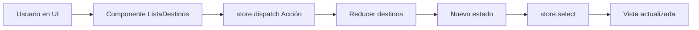

# Guía práctica de NgRx en este proyecto

Esta guía explica **exactamente** lo que implementaste en tu app, con ejemplos reales del código actual.

---

## 1) ¿Qué es NgRx (Redux en Angular)?

NgRx te ayuda a tener un estado centralizado y predecible.

Piensa en este flujo:

1. El usuario hace algo en la UI (agregar, elegir, borrar).
2. El componente dispara una **acción** (`dispatch`).
3. El **reducer** recibe estado actual + acción.
4. El reducer devuelve un **nuevo estado**.
5. La UI se actualiza de forma reactiva con `store.select(...)`.

---

## 2) Mapa rápido de tu implementación

- **Registro del store:** [src/app/app.config.ts](src/app/app.config.ts)
- **Estado + actions + reducer:** [src/app/models/destinos-viajes-state.model.ts](src/app/models/destinos-viajes-state.model.ts)
- **Componente que usa store:** [src/app/lista-destinos/lista-destinos.ts](src/app/lista-destinos/lista-destinos.ts)
- **Vista reactiva del listado:** [src/app/lista-destinos/lista-destinos.html](src/app/lista-destinos/lista-destinos.html)

---

## 3) Flujo visual (lo que pasa en tu app)

---

## 4) ¿Qué estado guardamos?

En `DestinosViajesState` guardas:

- `items`: colección de destinos.
- `favorito`: destino seleccionado.
- `loading`: bandera disponible para futuras mejoras.

Estado inicial:

- `items = []`
- `favorito = null`
- `loading = false`

---

## 5) Actions que construiste

En tu reducer hay 3 acciones principales:

- `NUEVO_DESTINO`
- `ELEGIDO_FAVORITO`
- `BORRAR_DESTINO`

### ¿Qué representa cada una?

- **Nuevo destino:** agrega un elemento a la colección.
- **Elegido favorito:** marca cuál destino está activo en `favorito`.
- **Borrar destino:** remueve elementos del arreglo y limpia `favorito` si se borró el seleccionado.

---

## 6) Reducer (la regla más importante)

El reducer **no debe mutar** el estado. Debe retornar una nueva copia.

Ejemplo de tu patrón correcto:

- Para agregar: `items: [...state.items, action.destino]`
- Para borrar: `items: state.items.filter(...)`
- Para elegir: `favorito: action.destino`

✅ Esto hace que Angular + NgRx detecten cambios correctamente y actualicen la UI.

---

## 7) Conexión del Store en la app

En `app.config.ts` registraste:

- `provideStore({ destinos: destinosReducer })`

Eso crea la “fuente única de verdad” para `destinos`.

Sin este paso, `Store` no funciona y la app puede fallar en runtime.

---

## 8) Componente reactivo (ListaDestinos)

En `ListaDestinos` usas observables del store:

- `destinos$ = this.store.select(state => state.destinos.items)`
- `favorito$ = this.store.select(state => state.destinos.favorito)`

Y en la plantilla:

- `@for (destino of (destinos$ | async); ...)`

Esto significa que **no renderizas desde arrays locales**, sino desde estado global reactivo.

---

## 9) Cómo se ejecutan tus 3 métodos

### `agregado(d)`

1. Registra actividad: `Se agregó...`
2. `dispatch(NuevoDestinoAction(d))`
3. `dispatch(ElegidoFavoritoAction(d))` (queda elegido automáticamente)

### `elegido(e)`

1. `dispatch(ElegidoFavoritoAction(e))`
2. La suscripción a `favorito` registra: `Se ha elegido...`

### `borrar(e)`

1. `dispatch(BorrarDestinoAction(e))`
2. Registra actividad: `Se borró...`
3. Si era favorito, el reducer lo limpia (`favorito = null`)

---

## 10) ¿Por qué antes “aparecía actividad pero no ejecutaba bien”?

Fue una combinación de problemas comunes:

- Mutación de estado en reducer (rompe reactividad esperada).
- Comparaciones por referencia para borrar (frágil si cambia la instancia).
- Selección visual apoyada en estado mutable del modelo, no en el store.

Ahora está corregido con enfoque inmutable + selección desde `favorito$`.

---

## 11) Buenas prácticas que ya estás aplicando

- Fuente única de estado (`store`).
- `dispatch` desde componentes.
- Reducer puro e inmutable.
- UI reactiva con `select + async`.

Excelente base para crecer a un proyecto profesional.

---

## 12) Siguiente nivel (cuando quieras)

1. Migrar acciones/reducer a API moderna (`createAction`, `createReducer`, `on`).
2. Crear **selectors** reutilizables (`selectItems`, `selectFavorito`).
3. Mover logs de actividad a un slice de estado propio.
4. Agregar `@ngrx/effects` real para llamadas HTTP.

---

## 13) BehaviorSubject vs NgRx (comparación del curso)

Esto te ayuda a entender por qué en clase ves “varias formas reactivas” y todas parecen válidas.

| Tema | BehaviorSubject en servicio | NgRx Store |
|---|---|---|
| Dificultad inicial | Baja | Media/Alta |
| Velocidad para prototipo | Muy rápida | Más lenta al inicio |
| Estructura | Flexible, libre | Estructurada (actions/reducer/selectors) |
| Escalabilidad | Se complica al crecer | Muy buena para apps grandes |
| Trazabilidad de cambios | Baja (más difícil auditar) | Alta (acciones explícitas) |
| Riesgo de lógica duplicada | Alto | Menor si sigues la arquitectura |
| Testing | Puede ser simple al inicio | Más predecible y sólido a largo plazo |
| Cuándo usar | Features pequeñas/locales | Estado global compartido |

### Regla práctica rápida

- Si el estado es pequeño y local: **BehaviorSubject**.
- Si el estado se comparte en varios componentes y crecerá: **NgRx**.
- Si mezclas ambos para el mismo dato, define una sola fuente de verdad.

### Aplicado a tu proyecto

- Tu feature de destinos ya está mejor en **NgRx** porque:
	- tienes varias acciones (`agregar`, `elegir`, `borrar`),
	- hay UI reactiva en varios puntos,
	- y necesitas consistencia en actividad + favorito + listado.

---

## 14) Mini glosario rápido

- **Store:** contenedor global de estado.
- **Action:** evento que describe “qué pasó”.
- **Reducer:** función pura que calcula nuevo estado.
- **Selector:** consulta optimizada del estado.
- **Dispatch:** envío de una acción al store.

---

## 15) Resumen en una frase

En tu app, NgRx quedó implementado para que **agregar, elegir y borrar destinos** modifique un estado global inmutable y la UI se actualice automáticamente de forma reactiva.
